# Contract Management Microservice

[](https://opensource.org/licenses/Apache-2.0)
[](https://openjdk.java.net/)
[](https://spring.io/projects/spring-boot)
[](https://www.postgresql.org/)

A contract management microservice that is part of the **Firefly OpenCore Platform** - an open-source core banking platform developed by Firefly Software Solutions Inc. This microservice manages relationships between customers (parties) and financial products, including contract lifecycle management, party roles, and dynamic contract terms.

## Overview

The Contract Management Microservice handles:

- **Customer-Product Relationships**: Links customers (partyId) with financial products through contracts
- **Product Catalog Integration**: Manages relationships with product types (productCatalogId) and specific products (productId). Contracts link parties with product catalog entries (productCatalogId as UUID) and the specific product instances (productId as UUID)
- **Role Management**: Defines and manages customer roles within contracts
- **Contract Lifecycle**: Handles contract creation, activation, amendments, suspension, and termination
- **Dynamic Terms**: Supports flexible contract terms that can be configured per contract
- **Risk Assessment**: Provides contract risk evaluation and scoring capabilities
- **Event Tracking**: Maintains comprehensive audit trails of contract-related events
- **Document Management**: Integrates with document management systems for contract documentation

## Table of Contents

- [Overview](#overview)
- [Features](#features)
- [Architecture](#architecture)
- [Entity Relationship Diagram](#entity-relationship-diagram)
- [Project Structure](#project-structure)
- [Quick Start](#quick-start)
- [Configuration](#configuration)
- [API Documentation](#api-documentation)
- [Database Schema](#database-schema)
- [Development](#development)
- [Testing](#testing)
- [Deployment](#deployment)
- [Contributing](#contributing)
- [License](#license)

## Features

### Core Functionality
- **Contract Management**: Full CRUD operations for contracts with status tracking
- **Party Management**: Associate multiple parties with contracts and define their roles
- **Dynamic Terms**: Flexible contract terms system with validation rules
- **Status History**: Complete audit trail of contract status changes
- **Event Logging**: Comprehensive event tracking for contract lifecycle
- **Risk Assessment**: Built-in risk scoring and assessment capabilities
- **Document Integration**: Reference external documents through document manager

### Technical Features
- **Reactive Programming**: Built with Spring WebFlux for high-performance async operations
- **R2DBC Integration**: Non-blocking database access with PostgreSQL
- **RESTful APIs**: Comprehensive REST endpoints with OpenAPI documentation
- **Database Migrations**: Flyway-managed database schema versioning
- **Validation**: Comprehensive input validation with custom annotations
- **Monitoring**: Built-in health checks and metrics endpoints
- **Multi-Profile Support**: Environment-specific configurations (dev, testing, prod)

## Architecture

The microservice follows a layered architecture pattern with clear separation of concerns:

```
┌─────────────────────────────────────────────────────────────┐
│                    Web Layer                                │
│  Controllers, REST Endpoints, OpenAPI Documentation        │
└─────────────────────────────────────────────────────────────┘
                              │
┌─────────────────────────────────────────────────────────────┐
│                   Service Layer                             │
│     Business Logic, Transaction Management                  │
└─────────────────────────────────────────────────────────────┘
                              │
┌─────────────────────────────────────────────────────────────┐
│                 Repository Layer                            │
│        R2DBC Repositories, Data Access                     │
└─────────────────────────────────────────────────────────────┘
                              │
┌─────────────────────────────────────────────────────────────┐
│                  Database Layer                             │
│              PostgreSQL with Flyway                        │
└─────────────────────────────────────────────────────────────┘
```

### Module Structure
- **core-common-contract-mgmt-web**: REST controllers and web configuration
- **core-common-contract-mgmt-core**: Business logic and service implementations
- **core-common-contract-mgmt-interfaces**: DTOs, enums, and API contracts
- **core-common-contract-mgmt-models**: R2DBC entities and repository interfaces
- **core-common-contract-mgmt-sdk**: Client SDK and OpenAPI specifications

## Entity Relationship Diagram

```mermaid
erDiagram
    %% Core Contract Entity
    CONTRACT {
        uuid contract_id PK "Primary Key - Auto-generated UUID"
        varchar_255 contract_number UK "Unique contract identifier"
        contract_status_enum contract_status "Current status (DRAFT, ACTIVE, etc.)"
        timestamp start_date "Contract effective start date"
        timestamp end_date "Contract expiration date"
        uuid product_catalog_id "Reference to product catalog entry in Product Management System"
        uuid product_id "Reference to specific product instance in Product Management System"
        timestamp created_at "Record creation timestamp"
        timestamp updated_at "Last modification timestamp"
    }

    %% Contract Party Relationship
    CONTRACT_PARTY {
        uuid contract_party_id PK "Primary Key - Auto-generated UUID"
        uuid contract_id FK "Foreign Key to CONTRACT"
        uuid party_id "Reference to Party Management System"
        uuid role_in_contract_id "Reference to Role Management System"
        timestamp date_joined "Date party joined the contract"
        timestamp date_left "Date party left the contract"
        boolean is_active "Current active status of party"
        timestamp created_at "Record creation timestamp"
        timestamp updated_at "Last modification timestamp"
    }

    %% Contract Documents
    CONTRACT_DOCUMENT {
        uuid contract_document_id PK "Primary Key - Auto-generated UUID"
        uuid contract_id FK "Foreign Key to CONTRACT"
        uuid document_type_id FK "Foreign Key to ContractDocumentType master data"
        uuid document_id "Reference to document in document management platform"
        timestamp date_added "Date document was added"
        timestamp created_at "Record creation timestamp"
        timestamp updated_at "Last modification timestamp"
    }

    %% Contract Status History
    CONTRACT_STATUS_HISTORY {
        uuid contract_status_history_id PK "Primary Key - Auto-generated UUID"
        uuid contract_id FK "Foreign Key to CONTRACT"
        status_code_enum status_code "Status transition code"
        timestamp status_start_date "When status became effective"
        timestamp status_end_date "When status ended (nullable)"
        timestamp created_at "Record creation timestamp"
        timestamp updated_at "Last modification timestamp"
    }

    %% Contract Events
    CONTRACT_EVENT {
        uuid contract_event_id PK "Primary Key - Auto-generated UUID"
        uuid contract_id FK "Foreign Key to CONTRACT"
        event_type_enum event_type "Type of event (CREATED, SIGNED, etc.)"
        timestamp event_date "When the event occurred"
        text event_description "Detailed description of the event"
        timestamp created_at "Record creation timestamp"
        timestamp updated_at "Last modification timestamp"
    }

    %% Risk Assessment
    CONTRACT_RISK_ASSESSMENT {
        uuid contract_risk_assessment_id PK "Primary Key - Auto-generated UUID"
        uuid contract_id FK "Foreign Key to CONTRACT"
        decimal_5_2 risk_score "Numerical risk score (0.00-999.99)"
        risk_level_enum risk_level "Risk level (LOW, MEDIUM, HIGH, CRITICAL)"
        timestamp assessment_date "Date of risk assessment"
        varchar_255 assessor "Who performed the assessment"
        text notes "Additional assessment notes"
        timestamp created_at "Record creation timestamp"
        timestamp updated_at "Last modification timestamp"
    }

    %% Contract Term Templates
    CONTRACT_TERM_TEMPLATE {
        uuid term_template_id PK "Primary Key - Auto-generated UUID"
        varchar_100 code UK "Unique template code identifier"
        varchar_255 name "Human-readable template name"
        text description "Detailed template description"
        term_category_enum term_category "Category (FINANCIAL, LEGAL, etc.)"
        term_data_type_enum data_type "Data type (TEXT, NUMERIC, JSON, etc.)"
        boolean is_required "Whether this term is mandatory"
        boolean is_active "Whether template is currently active"
        text default_value "Default value for the term"
        jsonb validation_rules "JSON validation rules"
        jsonb metadata "Additional metadata"
        timestamp created_at "Record creation timestamp"
        timestamp updated_at "Last modification timestamp"
    }

    %% Term Validation Rules
    CONTRACT_TERM_VALIDATION_RULE {
        uuid validation_rule_id PK "Primary Key - Auto-generated UUID"
        uuid term_template_id FK "Foreign Key to CONTRACT_TERM_TEMPLATE"
        term_validation_type_enum validation_type "Type of validation (REGEX, RANGE, etc.)"
        jsonb validation_value "Validation criteria as JSON object"
        varchar_500 error_message "Error message for validation failure"
        timestamp created_at "Record creation timestamp"
        timestamp updated_at "Last modification timestamp"
    }

    %% Dynamic Contract Terms
    CONTRACT_TERM_DYNAMIC {
        uuid term_id PK "Primary Key - Auto-generated UUID"
        uuid contract_id FK "Foreign Key to CONTRACT"
        uuid term_template_id FK "Foreign Key to CONTRACT_TERM_TEMPLATE"
        text term_value_text "Text value for the term"
        decimal_20_6 term_value_numeric "Numeric value for the term"
        jsonb term_value_json "JSON value for complex terms"
        timestamp effective_date "When this term becomes effective"
        timestamp expiration_date "When this term expires (nullable)"
        boolean is_active "Whether this term is currently active"
        text notes "Additional notes about the term"
        timestamp created_at "Record creation timestamp"
        timestamp updated_at "Last modification timestamp"
    }

    %% Relationships with cardinality and descriptions
    CONTRACT ||--o{ CONTRACT_PARTY : "has_parties"
    CONTRACT ||--o{ CONTRACT_DOCUMENT : "has_documents"
    CONTRACT ||--o{ CONTRACT_STATUS_HISTORY : "tracks_status_changes"
    CONTRACT ||--o{ CONTRACT_EVENT : "records_events"
    CONTRACT ||--o{ CONTRACT_RISK_ASSESSMENT : "has_risk_assessments"
    CONTRACT ||--o{ CONTRACT_TERM_DYNAMIC : "contains_dynamic_terms"

    CONTRACT_TERM_TEMPLATE ||--o{ CONTRACT_TERM_VALIDATION_RULE : "defines_validation_rules"
    CONTRACT_TERM_TEMPLATE ||--o{ CONTRACT_TERM_DYNAMIC : "instantiated_as"
```




## Project Structure

```
core-common-contract-mgmt/
├── core-common-contract-mgmt-web/          # Web layer (Controllers, REST APIs)
│   ├── src/main/java/com/firefly/core/contracts/web/
│   │   ├── controllers/                        # REST Controllers
│   │   └── ContractApplication.java            # Main Spring Boot Application
│   └── src/main/resources/
│       └── application.yaml                    # Application configuration
├── core-common-contract-mgmt-core/         # Business logic layer
│   └── src/main/java/com/firefly/core/contracts/core/
│       ├── services/                           # Service interfaces
│       ├── services/impl/                      # Service implementations
│       └── mappers/                            # MapStruct mappers
├── core-common-contract-mgmt-interfaces/   # API contracts
│   └── src/main/java/com/firefly/core/contracts/interfaces/
│       ├── dtos/                               # Data Transfer Objects
│       └── enums/                              # Enumerations
├── core-common-contract-mgmt-models/       # Data layer
│   └── src/main/java/com/firefly/core/contracts/models/
│       ├── entities/                           # R2DBC Entities
│       ├── repositories/                       # Repository interfaces
│       └── resources/db/migration/             # Flyway migrations
└── core-common-contract-mgmt-sdk/          # Client SDK
    └── src/main/resources/api-spec/
        └── openapi.yml                         # OpenAPI specification
```

## Quick Start

### Prerequisites

- **Java 17+**: OpenJDK or Oracle JDK
- **Maven 3.8+**: For building the project
- **PostgreSQL 15+**: Database server
- **Docker** (optional): For containerized deployment

### 1. Clone the Repository

```bash
git clone https://github.com/firefly-oss/core-common-contract-mgmt.git
cd core-common-contract-mgmt
```

### 2. Database Setup

Create a PostgreSQL database and user:

```sql
CREATE DATABASE contract_mgmt;
CREATE USER contract_user WITH PASSWORD 'contract_password';
GRANT ALL PRIVILEGES ON DATABASE contract_mgmt TO contract_user;
```

### 3. Environment Configuration

Set the following environment variables:

```bash
export DB_HOST=localhost
export DB_PORT=5432
export DB_NAME=contract_mgmt
export DB_USERNAME=contract_user
export DB_PASSWORD=contract_password
export DB_SSL_MODE=disable
export SERVER_PORT=8080
```

### 4. Build and Run

```bash
# Build the project
mvn clean install

# Run the application
cd core-common-contract-mgmt-web
mvn spring-boot:run
```

### 5. Verify Installation

- **Health Check**: http://localhost:8080/actuator/health
- **API Documentation**: http://localhost:8080/swagger-ui.html
- **OpenAPI Spec**: http://localhost:8080/v3/api-docs

## Configuration

### Application Profiles

The application supports multiple profiles for different environments:

- **dev**: Development environment with debug logging
- **testing**: Testing environment with moderate logging
- **prod**: Production environment with minimal logging

### Key Configuration Properties

```yaml
spring:
  application:
    name: core-common-contract-mgmt
    version: 1.0.0
    description: Contract Management Core Application

  r2dbc:
    url: r2dbc:postgresql://${DB_HOST}:${DB_PORT}/${DB_NAME}
    username: ${DB_USERNAME}
    password: ${DB_PASSWORD}

  flyway:
    enabled: true
    baseline-on-migrate: true
    locations: classpath:db/migration

server:
  port: ${SERVER_PORT:8080}
  shutdown: graceful
```

### Environment Variables

| Variable | Description | Default | Required |
|----------|-------------|---------|----------|
| `DB_HOST` | Database host | localhost | Yes |
| `DB_PORT` | Database port | 5432 | Yes |
| `DB_NAME` | Database name | - | Yes |
| `DB_USERNAME` | Database username | - | Yes |
| `DB_PASSWORD` | Database password | - | Yes |
| `DB_SSL_MODE` | SSL mode for database | disable | No |
| `SERVER_PORT` | Application port | 8080 | No |
| `SERVER_ADDRESS` | Bind address | localhost | No |

## API Documentation

### REST Endpoints

The microservice provides comprehensive REST APIs for contract management:

#### Contracts
- `POST /api/v1/contracts/filter` - Filter and list contracts
- `POST /api/v1/contracts` - Create a new contract
- `GET /api/v1/contracts/{contractId}` - Get contract by ID
- `PUT /api/v1/contracts/{contractId}` - Update contract
- `DELETE /api/v1/contracts/{contractId}` - Delete contract

#### Contract Parties
- `POST /api/v1/contracts/{contractId}/parties/filter` - Filter contract parties
- `POST /api/v1/contracts/{contractId}/parties` - Add party to contract
- `GET /api/v1/contracts/{contractId}/parties/{contractPartyId}` - Get specific party
- `PUT /api/v1/contracts/{contractId}/parties/{contractPartyId}` - Update party
- `DELETE /api/v1/contracts/{contractId}/parties/{contractPartyId}` - Remove party

#### Contract Terms (Dynamic)
- `POST /api/v1/contracts/{contractId}/terms/filter` - Filter contract terms
- `POST /api/v1/contracts/{contractId}/terms` - Add contract term
- `GET /api/v1/contracts/{contractId}/terms/{termId}` - Get term by ID
- `PUT /api/v1/contracts/{contractId}/terms/{termId}` - Update term
- `DELETE /api/v1/contracts/{contractId}/terms/{termId}` - Remove term

#### Contract Events
- `POST /api/v1/contracts/{contractId}/events/filter` - Filter contract events
- `POST /api/v1/contracts/{contractId}/events` - Create contract event
- `GET /api/v1/contracts/{contractId}/events/{contractEventId}` - Get event by ID
- `PUT /api/v1/contracts/{contractId}/events/{contractEventId}` - Update event
- `DELETE /api/v1/contracts/{contractId}/events/{contractEventId}` - Remove event

#### Contract Documents
- `POST /api/v1/contracts/{contractId}/documents/filter` - Filter contract documents
- `POST /api/v1/contracts/{contractId}/documents` - Add contract document
- `GET /api/v1/contracts/{contractId}/documents/{contractDocumentId}` - Get document by ID
- `PUT /api/v1/contracts/{contractId}/documents/{contractDocumentId}` - Update document
- `DELETE /api/v1/contracts/{contractId}/documents/{contractDocumentId}` - Remove document

#### Contract Status History
- `POST /api/v1/contracts/{contractId}/status-history/filter` - Filter status history
- `POST /api/v1/contracts/{contractId}/status-history` - Create status history entry
- `GET /api/v1/contracts/{contractId}/status-history/{contractStatusHistoryId}` - Get status history by ID

#### Contract Risk Assessments
- `POST /api/v1/contracts/{contractId}/risk-assessments/filter` - Filter risk assessments
- `POST /api/v1/contracts/{contractId}/risk-assessments` - Create risk assessment
- `GET /api/v1/contracts/{contractId}/risk-assessments/{contractRiskAssessmentId}` - Get risk assessment by ID
- `PUT /api/v1/contracts/{contractId}/risk-assessments/{contractRiskAssessmentId}` - Update risk assessment
- `DELETE /api/v1/contracts/{contractId}/risk-assessments/{contractRiskAssessmentId}` - Remove risk assessment

#### Contract Term Templates
- `POST /api/v1/term-templates/filter` - Filter term templates
- `POST /api/v1/term-templates` - Create term template
- `GET /api/v1/term-templates/{termTemplateId}` - Get term template by ID
- `PUT /api/v1/term-templates/{termTemplateId}` - Update term template
- `DELETE /api/v1/term-templates/{termTemplateId}` - Delete term template

#### Contract Term Validation Rules
- `POST /api/v1/term-templates/{termTemplateId}/validation-rules/filter` - Filter validation rules
- `POST /api/v1/term-templates/{termTemplateId}/validation-rules` - Create validation rule
- `GET /api/v1/term-templates/{termTemplateId}/validation-rules/{validationRuleId}` - Get validation rule by ID
- `PUT /api/v1/term-templates/{termTemplateId}/validation-rules/{validationRuleId}` - Update validation rule
- `DELETE /api/v1/term-templates/{termTemplateId}/validation-rules/{validationRuleId}` - Delete validation rule

### OpenAPI Specification

The complete API specification is available at:
- **Swagger UI**: http://localhost:8080/swagger-ui.html
- **OpenAPI JSON**: http://localhost:8080/v3/api-docs
- **OpenAPI YAML**: Available in `core-common-contract-mgmt-sdk/src/main/resources/api-spec/openapi.yml`

### Example API Usage

#### Create a Contract
```bash
curl -X POST http://localhost:8080/api/v1/contracts \
  -H "Content-Type: application/json" \
  -d '{
    "contractNumber": "CNT-2024-001",
    "contractStatus": "DRAFT",
    "startDate": "2024-01-01T00:00:00",
    "endDate": "2024-12-31T23:59:59"
  }'
```

#### Add Party to Contract
```bash
curl -X POST http://localhost:8080/api/v1/contracts/550e8400-e29b-41d4-a716-446655440000/parties \
  -H "Content-Type: application/json" \
  -d '{
    "partyId": "550e8400-e29b-41d4-a716-446655440001",
    "roleInContractId": "550e8400-e29b-41d4-a716-446655440002",
    "dateJoined": "2024-01-01T00:00:00",
    "isActive": true
  }'
```

## Database Schema

### Database Migrations

Database schema is managed using Flyway migrations located in:
`core-common-contract-mgmt-models/src/main/resources/db/migration/`

- `V1__Create_Enums.sql` - Creates all enumeration types
- `V2__Create_Tables.sql` - Creates all tables and relationships
- `V3__Create_Casts.sql` - Creates enum casting functions

### Key Enumerations

- **Contract Status**: DRAFT, PENDING_APPROVAL, ACTIVE, SUSPENDED, TERMINATED, EXPIRED, CANCELLED
- **Event Types**: CONTRACT_CREATED, CONTRACT_SIGNED, CONTRACT_ACTIVATED, CONTRACT_AMENDED, PAYMENT_DUE, BREACH_REPORTED
- **Risk Levels**: LOW, MEDIUM, HIGH, CRITICAL
- **Term Categories**: FINANCIAL, LEGAL, OPERATIONAL, COMPLIANCE, PERFORMANCE, DELIVERY, PAYMENT

## Development

### Running in Development Mode

```bash
# Set development profile
export SPRING_PROFILES_ACTIVE=dev

# Run with Maven
mvn spring-boot:run -Dspring-boot.run.profiles=dev
```

### Docker Development

```bash
# Start PostgreSQL with Docker
docker run --name contract-postgres \
  -e POSTGRES_DB=contract_mgmt \
  -e POSTGRES_USER=contract_user \
  -e POSTGRES_PASSWORD=contract_password \
  -p 5432:5432 \
  -d postgres:15

# Build and run application
mvn clean package
docker build -t contract-mgmt .
docker run -p 8080:8080 --link contract-postgres:db contract-mgmt
```

## Testing

### Running Tests

```bash
# Run all tests
mvn test

# Run with coverage
mvn test jacoco:report
```

## Deployment

### Docker Production Deployment

```dockerfile
FROM openjdk:17-jre-slim

COPY target/core-common-contract-mgmt-web-*.jar app.jar

EXPOSE 8080

ENTRYPOINT ["java", "-jar", "/app.jar"]
```

```bash
# Build production image
docker build -t firefly/contract-mgmt:1.0.0 .

# Run in production
docker run -d \
  --name contract-mgmt-prod \
  -p 8080:8080 \
  -e SPRING_PROFILES_ACTIVE=prod \
  -e DB_HOST=prod-db-host \
  -e DB_USERNAME=prod_user \
  -e DB_PASSWORD=prod_password \
  firefly/contract-mgmt:1.0.0
```

### Health Checks and Monitoring

- **Liveness Probe**: `/actuator/health/liveness`
- **Readiness Probe**: `/actuator/health/readiness`
- **Metrics**: `/actuator/prometheus`
- **Info**: `/actuator/info`

## Contributing

We welcome contributions to the Firefly OpenCore Platform! Please follow these guidelines:

### Getting Started

1. **Fork** the repository
2. **Clone** your fork locally
3. **Create** a feature branch from `main`
4. **Make** your changes following our coding standards
5. **Test** your changes thoroughly
6. **Submit** a pull request

### Coding Standards

- Follow existing code style and conventions
- Write comprehensive unit and integration tests
- Update documentation for any API changes
- Use meaningful commit messages
- Ensure all tests pass before submitting PR

### Pull Request Process

1. Update the README.md with details of changes if applicable
2. Update the OpenAPI specification for API changes
3. Increase version numbers following semantic versioning
4. Ensure CI/CD pipeline passes
5. Request review from maintainers

## License

This project is licensed under the **Apache License 2.0** - see the [LICENSE](LICENSE) file for details.

```
Copyright 2024 Firefly Software Solutions Inc

Licensed under the Apache License, Version 2.0 (the "License");
you may not use this file except in compliance with the License.
You may obtain a copy of the License at

    http://www.apache.org/licenses/LICENSE-2.0

Unless required by applicable law or agreed to in writing, software
distributed under the License is distributed on an "AS IS" BASIS,
WITHOUT WARRANTIES OR CONDITIONS OF ANY KIND, either express or implied.
See the License for the specific language governing permissions and
limitations under the License.
```

